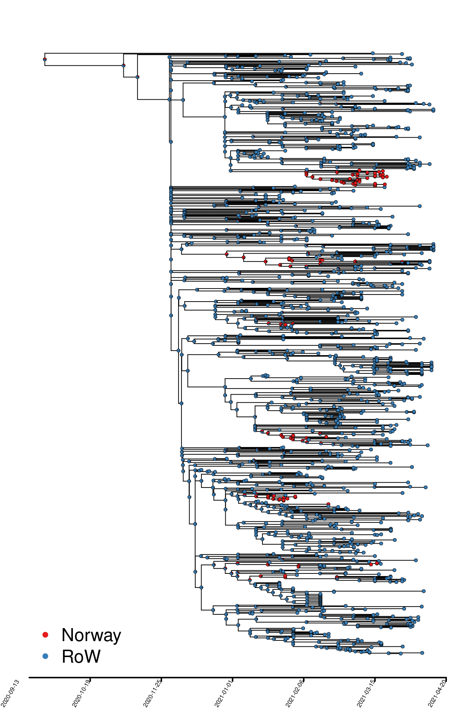
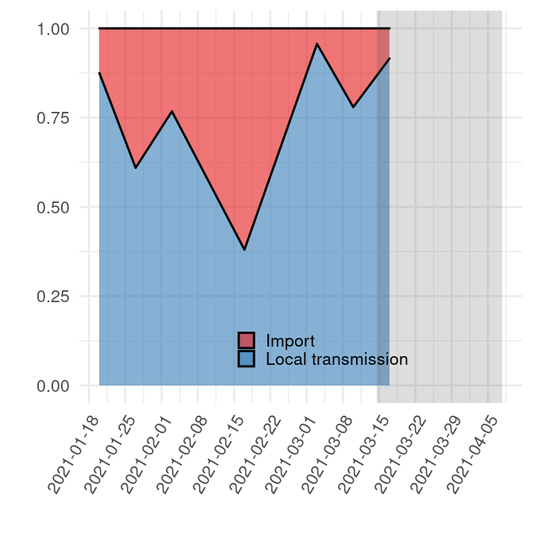
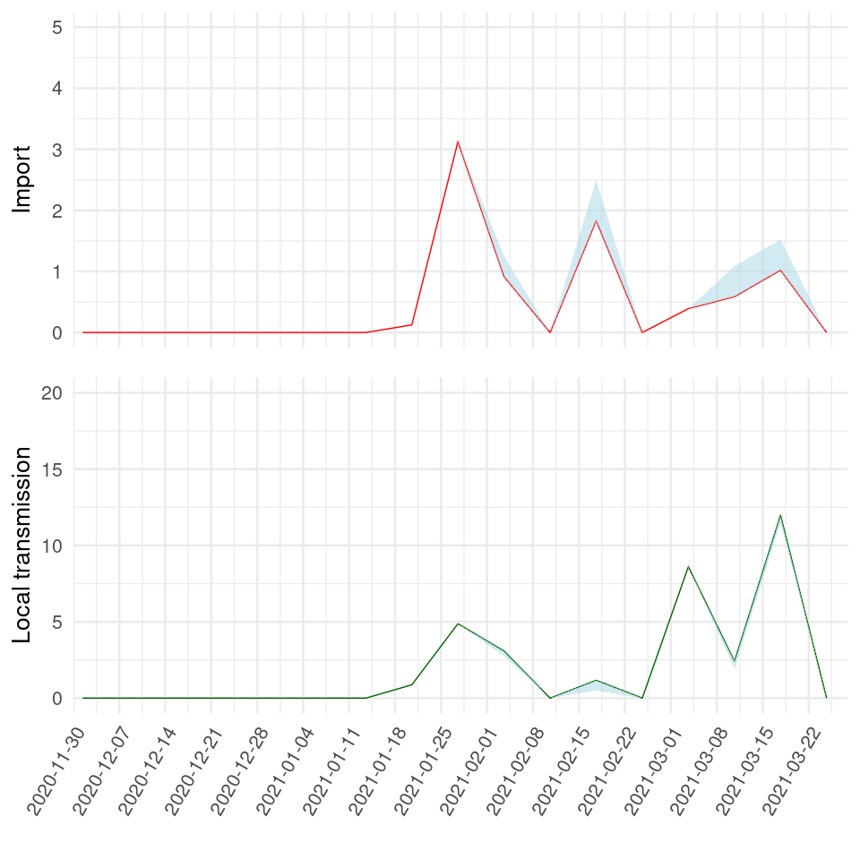
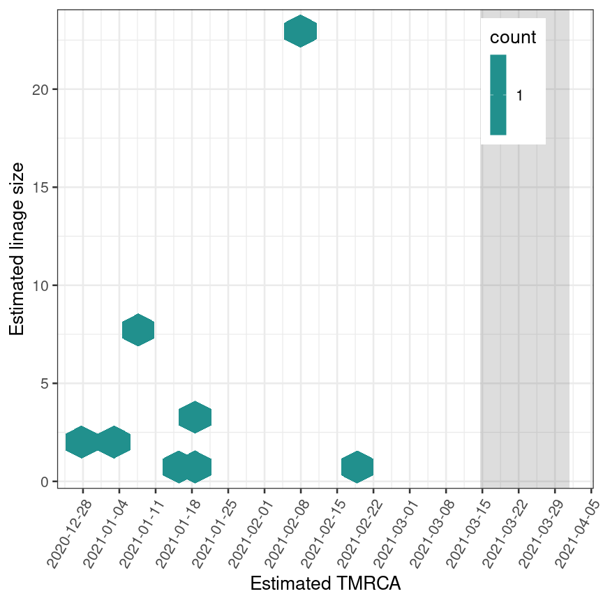

Results - B.1.525, “International lineage with variants of biological
significance”
================
27/04/2021

Phylogeographic mapping

Ancestral character estimation was performed on a dated phylogeny
exported from NextStrain. Each isolate was assigned to one of two binary
categories: “Norway” or “Rest of the world (RoW)”. The output is
presented in Fig.1.

<!-- -->

##### Fig. 1. B.1.525 phylogeny colored by binary geographic mappings (Norway, rest of the world \[RoW\]).

The number of Norwegian isolates resulting from local transmission vs
introductions from abroad were estimated from the tree and is summarized
in Table 1.

##### Table 1. Estimated number of Norwegian infections that are caused by import and local transmission in geographically mapped phylogeny in Figure 1.

|                    |    2.5% |     50% |   97.5% |
|:-------------------|--------:|--------:|--------:|
| Import             |  8.0000 |  8.0000 |  9.0000 |
| Local transmission | 32.0000 | 33.0000 | 33.0000 |
| Import / Total     |  0.1951 |  0.1951 |  0.2195 |

<!-- -->

###### Fig. 2. Relative quantification of infection source (new introduction / import vs local transmission).

<!-- -->

###### Fig. 3. Absolute quantification of imports and local transmission events.

<!-- -->

###### Fig. 4. Transmission lineage sizes as a function of time of introduction. “TMRCA” = time of most recent common ancestor.
