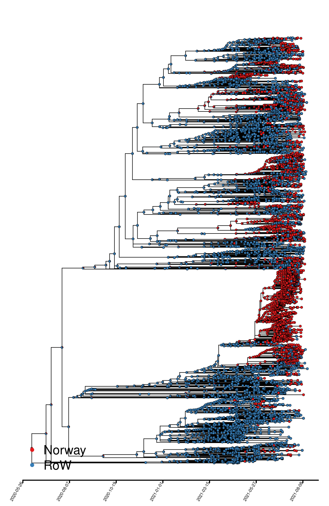
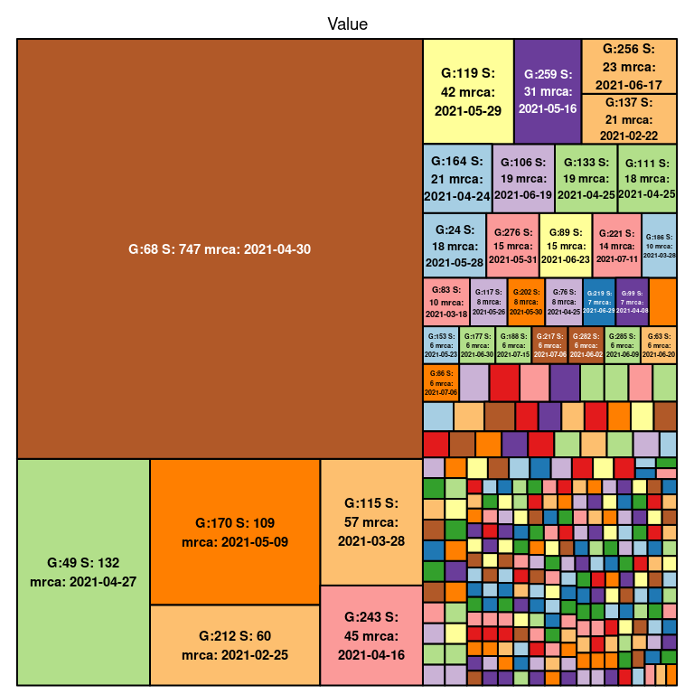
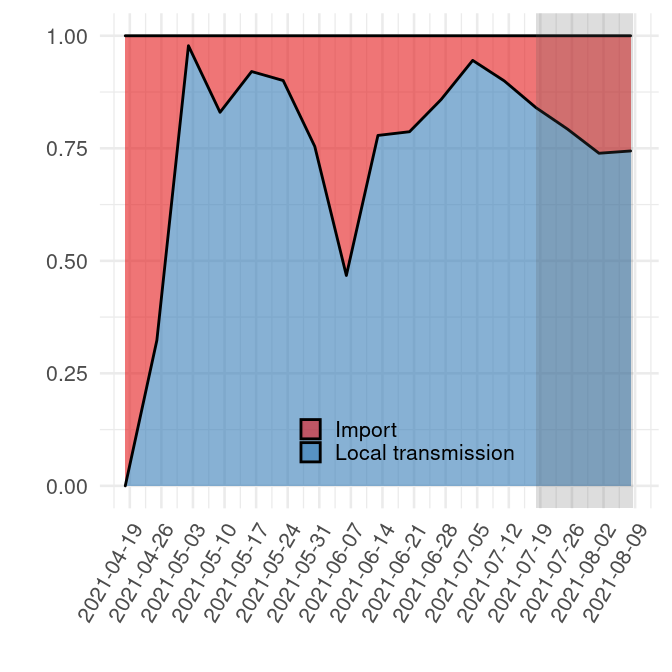
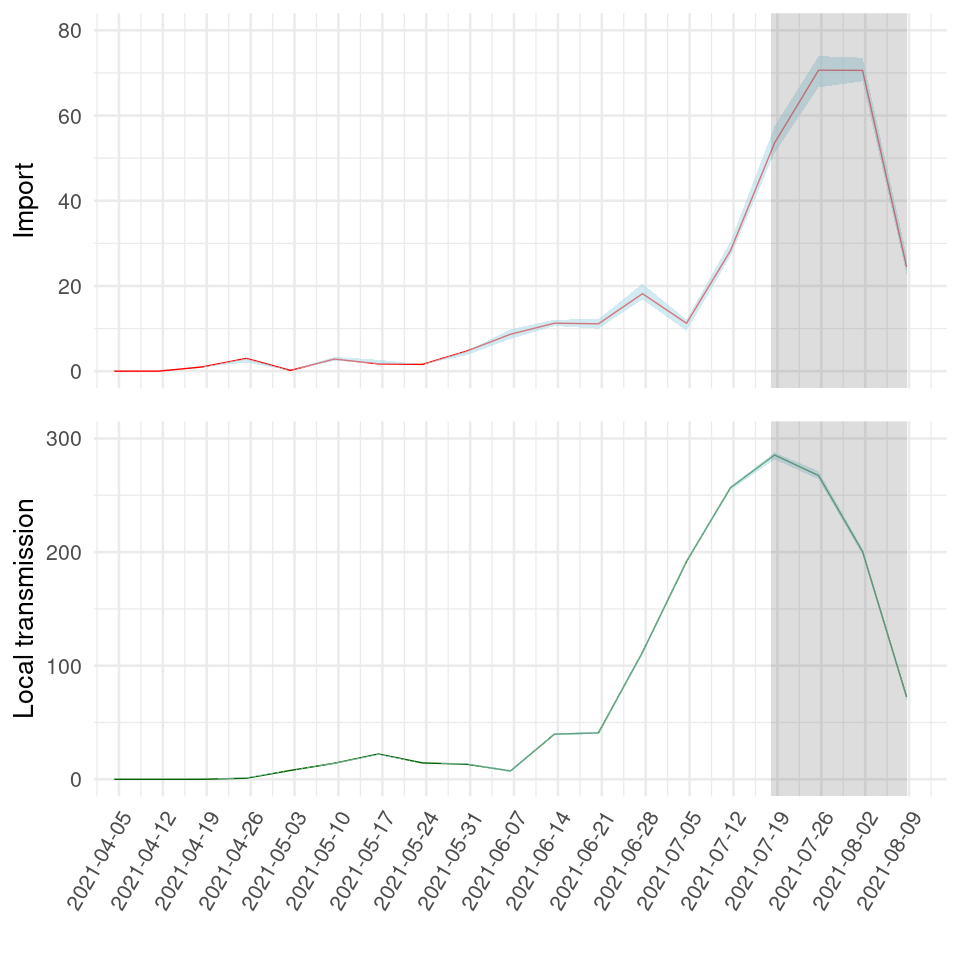
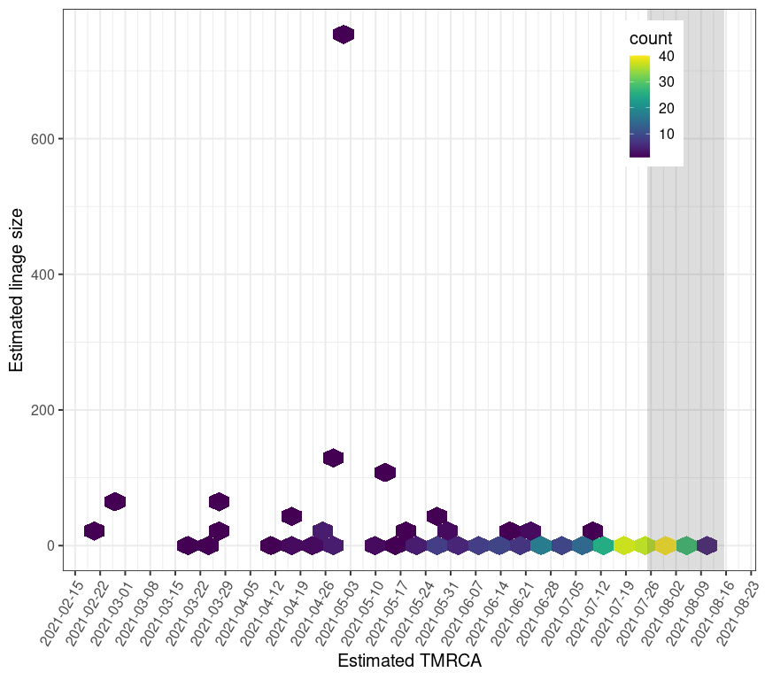

Results - B.1.617.2, “Delta variant”
================
13/07/2021

Phylogeographic mapping

Ancestral character estimation was performed on a dated phylogeny
exported from NextStrain. Each isolate was assigned to one of two binary
categories: “Norway” or “Rest of the world (RoW)”. The output is
presented in Fig.1.

<!-- -->

##### Fig. 1. B.1.351 phylogeny colored by binary geographic mappings (Norway, rest of the world \[RoW\]).

Quantifying introductions and local transmission

Below is a visualization of the size of each transmission lineage
detected in Norway.

<!-- -->

##### Fig. 2. B.1.351 transmission lineage sizes in Norway. G denotes the number assigned to each lineage, S denotes the size of the lineage and TMRCA denotes the age of the lineage.

The number of Norwegian isolates resulting from local transmission vs
introductions from abroad were estimated from the tree and is summarized
in Table 1.

##### Table 1. Estimated number of Norwegian infections that are caused by import and local transmission in geographically mapped phylogeny in Figure 1.

|                    |    2.5% |      50% |   97.5% |
|:-------------------|--------:|---------:|--------:|
| Import             |  53.000 |  54.0000 |  55.000 |
| Local transmission | 233.000 | 234.0000 | 235.000 |
| Import / Total     |   0.184 |   0.1875 |   0.191 |

<!-- -->

###### Fig. 3. Relative quantification of infection source (new introduction / import vs local transmission).

<!-- -->

###### Fig. 4. Absolute quantification of imports and local transmission events.

<!-- -->

###### Fig. 5. Transmission lineage sizes as a function of time of introduction. “TMRCA” = time of most recent common ancestor.
