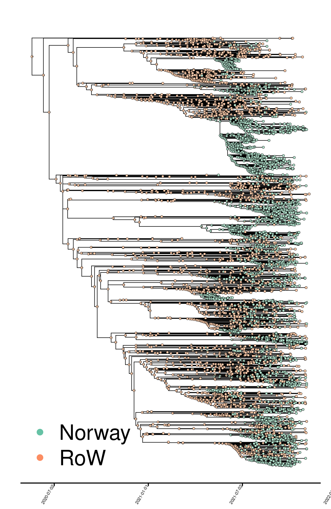
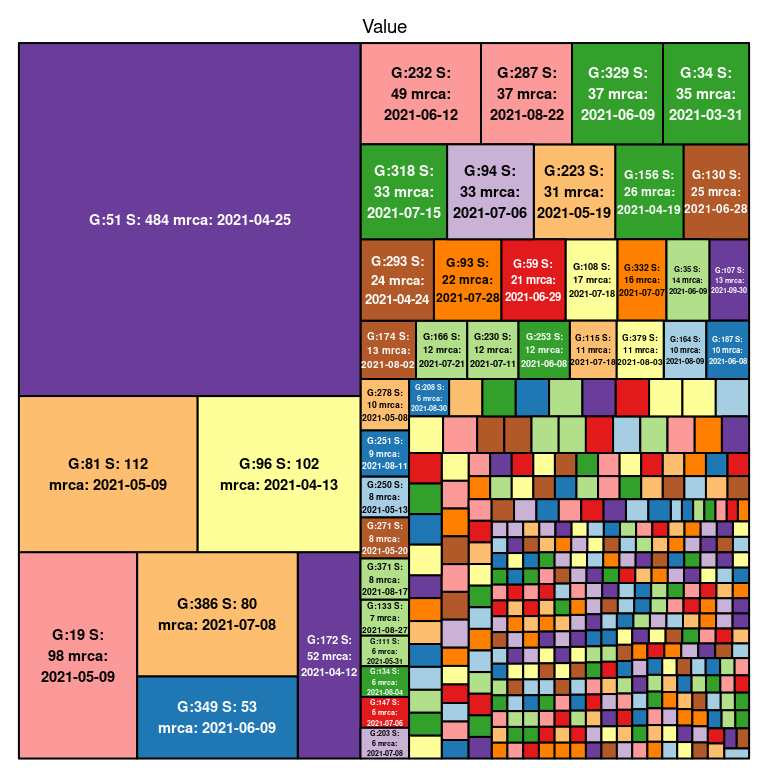
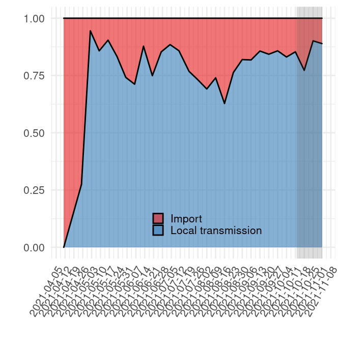
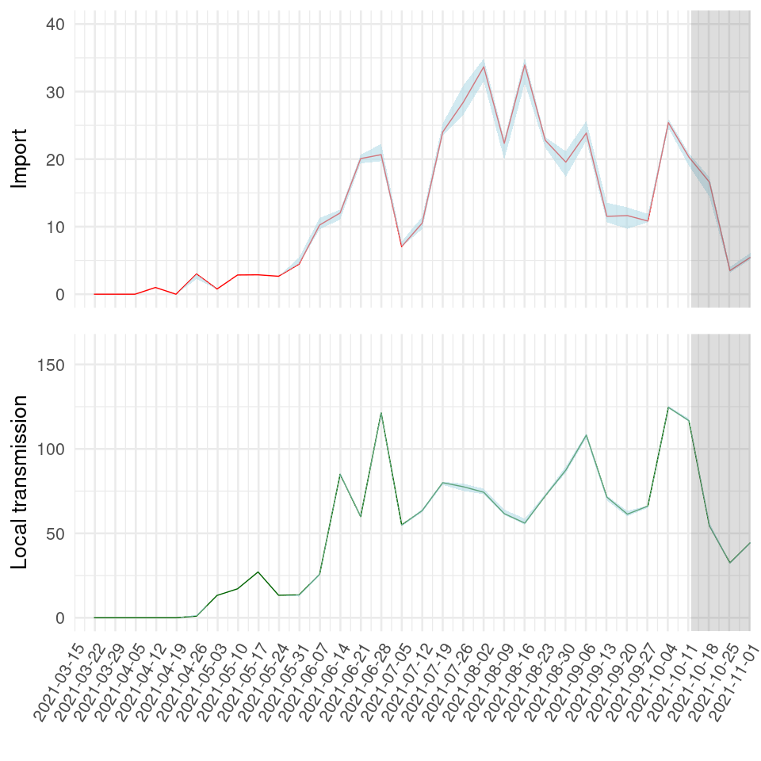
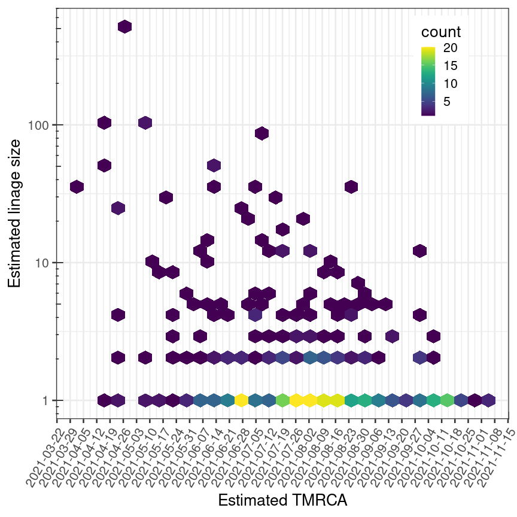

Results - “Delta variant”
================
16/08/2021

Phylogeographic mapping

The analyses take a dated phylogeny exported from NextStrain as a
starting point for quantifying imports and local transmission of
Sars-CoV-2 Delta variant in Norway. Each isolate is assigned to one of
two binary categories: “Norway” or “Rest of the world (RoW)”. The output
is presented in Fig.1 and ancestral character estimation performed on
the dated phylogeny.

##### Fig. 1. B.1.617.2 phylogeny colored by binary geographic mappings (Norway, rest of the world \[RoW\]).

Quantifying introductions and local transmission

Below is a visualization of the size of each transmission lineage
detected in Norway.

<!-- -->
\#\#\#\#\# Fig. 2. B.1.617.2 transmission lineage sizes in Norway. G
denotes the number assigned to each lineage, S denotes the size of the
lineage and TMRCA denotes the age of the lineage.

##### Table 1. Estimated number of infections in Norway resulting from import and local transmission based on the phylogeographic analyses in Figure 1.

|                    |      2.5% |       50% |     97.5% |
|:-------------------|----------:|----------:|----------:|
| Import             |  466.2250 |  471.5000 |  478.5500 |
| Local transmission | 1391.4500 | 1398.5000 | 1403.7750 |
| Import / Total     |    0.2493 |    0.2521 |    0.2559 |

Next, we estimate the fraction of introductions relative to local
transmission over time. In these and subsequent analyses it is important
to keep detection lag into account (see
<https://science.sciencemag.org/content/371/6530/708>). There will
always be a delay between the introduction and detection, which varies
from case to case. In the figures below, the last four weeks prior to
the time of sampling of the most recent included isolate is shaded to
indicate that estimates in this period is highly uncertain.

<!-- -->

##### Fig. 3. Relative quantification of infection source (new introduction / import vs local transmission).

The same output is visualized as absolute numbers in Fig. 3 below. It
should be noted that absolute estimates will be significantly shaped by
sampling density.

<!-- -->

##### Fig. 4. Absolute quantification of imports and local transmission events.

Perhaps the most interesting aspect of quantifying introductions, is to
investigate the fate of the introduced viruses. Mandatory testing at the
border and/or mandatory quaranteens etc will obviously have a bearing on
the fate of new introductions from abroad. The plot below visualizes the
number of infections in Norway resulting from each identified virus
import event over time, stratified by inferred TMRCA of each introduced
lineage.

<!-- -->

##### Fig. 5. Transmission lineage sizes as a function of time of introduction. “TMRCA” = time of most recent common ancestor.
