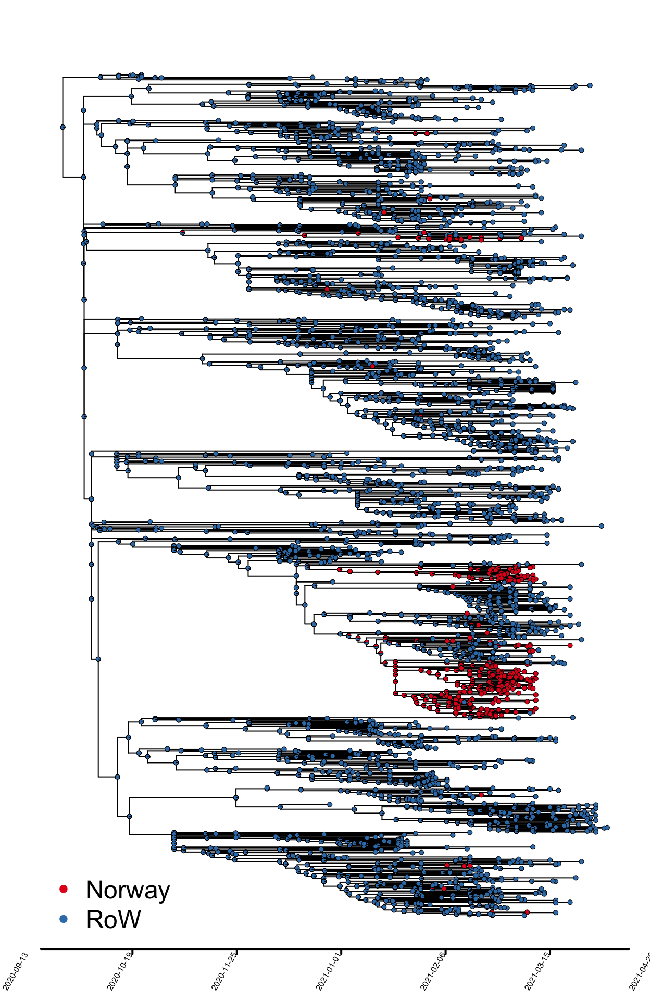

Untitled
================
Magnus Nygård Osnes
4/8/2021

# Resultater - B.1.351, “Sør Afrika variant”

Import og lokal smitte over tid

Antall sekvenser over tid som estimeres å være resultat av import samt
tilfeller som er resultat av smitte i Norge (Fig. 4).

Fig. 4. Import og transmisjon av B.1.351. Estimert antall
import-hendelser (øverst) og lokale transmisjoner (nederst) per uke. Det
er knyttet stor usikkerhet rundt estimater i perioden skravert i grått.

Fig. 5. Forhold mellom import og lokaltransmisjon av B.1.351 over tid i
Norge. OBS, ingen sekvenserte isolater som er nyere enn 10. mars.

Fig 6. Klyngestørrelser som funksjon av importtidspunkt, B.1.135 “TMRCA”
= time of most recent common ancestor, og indikerer estimert tidspunkt
for hver enkelt import. Den store klyngen som skiller seg ut her
tilsvarer Bodø-utbruddet.

``` r
library(ips)
cols<-setNames( c("#E41A1C","#377EB8"),unique(Locations))
plot.phylo(tree,cex=0.3, mar=c(5.1,0.2,0.2,0.2),show.tip.label = F,edge.width=2)
axisPhylo(1,root.time= decimal_date(mrsd)-max(tipHeights(tree)), backward = F, lwd=4)
nodelabels(pie=castor$ancestral_likelihoods,cex=0.2,piecol=cols)
tiplabels(pie=to.matrix(Locations,seq=c("Norway","RoW")),cex=0.2,piecol=cols)
#abline(v=seq(0,382,10), lty=2, col="grey")
legend("bottomleft",c("Norway", "RoW"), col = c("#E41A1C","#377EB8"), bty="n",pch=20, cex = 1, pt.cex=1)
```

<!-- -->

``` r
# 
```

library(data.table) library(lubridate) metadat =
fread(“\~/Dropbox/Covid/Southafrican\_03\_24/nextstrain\_groups\_niph\_ncov\_southafrican-2021-03-25\_metadata.tsv”)

\#Extract the most recent dates. mrsd =
max(metadat$\`Collection Data\`) dec\_date = decimal\_date(max(metadat$`Collection Data`))
start\_date = dec\_date-max(tipHeights(tree))

\#ADD start time here. Norwegian\_tips =
names(Locations\[Locations==“Norway”\])
source(“\~/Dropbox/Rfunctions/Import\_export\_ace\_output.R”) Result =
count\_import\_export\_ace(tree, ace\_nodes =
castor$ancestral\_likelihoods, give\_tips = Norwegian\_tips,ace\_tips = to.matrix(Locations,seq=c("Norway","RoW")),start\_time = start\_date) Result = count\_import\_export\_ace\_uncertainty(tree, ace\_nodes = castor$ancestral\_likelihoods,
give\_tips = Norwegian\_tips,ace\_tips =
to.matrix(Locations,seq=c(“Norway”,“RoW”)),start\_time = start\_date)
Result$`MRCA's`

save(Result, file=“\~/Dropbox/Covid/Southafrican\_03\_24/Result.Rdata”)

library(lubridate) all\_lineages = Result\[\[2\]\] \#Plot lineages:

library(treemap) library(RColorBrewer) library(ggtree) \#Treemap
lineages. atreemap =
data.frame(group=paste0(“G:”,1:length(all\_lineages)," S: “,
all\_lineages,” mrca:
“,decimal2Date(Result$`MRCA's`)),Value=all\_lineages)
treemap(atreemap,index=(”group“),vSize=”Value“, type=”index“,
palette=”Paired")

\#For greying out smaller lineages. \#
paste0(“G:”,1:length(all\_lineages)," S: ", all\_lineages) \#
qual\_col\_pals = brewer.pal.info\[brewer.pal.info$category == ‘qual’,\]
\# colvar = (all\_lineages&gt;=2)\*1 \# col\_list =
unlist(mapply(brewer.pal,
qual\_col\_pals$maxcolors, rownames(qual\_col\_pals)))\[1:length(which(colvar==1))\] \# small\_col = "\#BABABA" \# colvar\[which(colvar==1)\]=col\_list \# colvar\[which(colvar==0)\]=small\_col \# atreemap = data.frame(group=paste0("G:",1:length(all\_lineages)," S: ", all\_lineages, " tmrca: ", \# decimal2Date(Result$`MRCA's`)),Value=all\_lineages,vColor=colvar)
\#
pdf(paste0(path\_to\_results,“treemap\_lineages.pdf”),width=20,height=20)
\# treemap(atreemap,index=(“group”),vSize=“Value”,
type=“color”,vColor=“vColor”) \# dev.off()

\#metadata
=read.table(“\~/Dropbox/Covid/metadata\_samples/metadata\_import\_export\_2021-02-03.tsv”,
header=T)

# \#Set up time windows for counting state changes

# tree = ARD2650\[\[1\]\]

# \_\_\_\_\_\_\_\_\_\_\_\_\_\_\_\_\_\_\_\_\_\_\_\_\_\_\_\_\_\_\_\_\_\_\_\_\_\_\_\_\_\_\_\_\_\_\_\_\_\_\_\_\_\_\_\_\_\_\_\_\_\_\_\_\_\_\_\_\_\_\_\_\_\_\_\_

# Read the metadata for this section

library(data.table) library(ggtree) library(treedater) mrsd =
max(metadat$`Collection Data`)

library(lubridate) most\_recent\_date = ymd(mrsd) most\_recent\_date =
decimal\_date(most\_recent\_date) start\_time =
most\_recent\_date-max(nodeHeights(tree)) time\_end =
most\_recent\_date-start\_time

# \_\_\_\_\_\_\_\_\_\_\_\_\_\_\_\_\_\_\_\_\_\_\_\_\_\_\_\_\_\_\_\_\_\_\_\_\_\_\_\_\_\_\_\_\_\_\_\_\_\_\_\_\_\_\_\_\_\_\_\_\_\_\_\_\_\_\_\_\_\_\_\_\_\_\_\_

# Import export estimates

source(“/Users/magnusnygardosnes/Dropbox/Rfunctions/Import\_export\_ace\_output.R”)
library(viridis) \#Result2 = matrix(unlist(lapply(mapped\_tree, FUN=
function(x) count\_import\_export(x, give\_tips
=norwegian\_tips)\[\[1\]\])), nrow=1000, ncol=2, byrow=T) Result=
count\_import\_export\_ace(tree, ace\_nodes =
castor$ancestral\_likelihoods, give\_tips = Norwegian\_tips,ace\_tips =
to.matrix(Locations,seq=c(“Norway”,“RoW”)),start\_time = start\_date)
quantile(Result2\[,1\], c(0.025, 0.50,0.975)); quantile(Result2\[,2\],
c(0.025, 0.50,0.975));
quantile(Result2\[,2\]/(Result2\[,2\]+Result2\[,1\]), c(0.025,
0.50,0.975))

\#\#MRCA’s lineages size. plot(hist(Result\[\[4\]\], breaks=100)) c2 =
data.frame(decimal2Date(cbind(Result$\`MRCA's\`)),Result$Lineage\_sizes)
colnames(c2)=c(“MRCA”,“Lineagesize”)

ggplot(c2, aes(MRCA, Lineagesize))+ geom\_hex()+
theme\_bw(base\_size=20)+ theme(legend.position=c(0.85,0.85))+
scale\_fill\_viridis()+ scale\_x\_date(date\_breaks=“1 week”)+
theme(axis.text.x=element\_text(angle=60, hjust=1))+ xlab(“Estimated
TMRCA”)+ylab(“Estimated linage size”)+
annotate(“rect”,xmin=as.Date(decimal2Date(time\_end-1/12)),xmax=as.Date(dat*d**a**t**e**s*\[*l**e**n**g**t**h*(*d**a**t*dates)\]),ymin=-Inf,ymax=Inf,alpha=0.2)

\#Lineage size versus \# library(hexbin) \#
my\_colors=colorRampPalette(rev(brewer.pal(11,‘Spectral’))) \#
pdf(paste0(path\_to\_results,“import\_and\_Export\_over\_time.pdf”),
width=10,height=10) \# plot(hexbin(c2),ylab=“Logarithm of lineage size”,
xlab=“Esitmated TMRCA”,colramp=my\_colors,xaxt=“n”) \# xaxisticks
=seq(from=range(Result$\`MRCA's\`)\[1\], to=range(Result$`MRCA's`)\[2\],
length.out=10) \# axis(1,at =xaxisticks,
labels=as.character(decimal2Date(xaxisticks))) \# dev.off() \#
plot(c2\[,1\],c2\[,2\],xlab=“Logarithm of lineage size”, ylab=“Esitmated
TMRCA”) \# \# \# weekly\_counts =
table(cut(Result$`MRCA's`,breaks=seq(start\_time,decimal\_date(mrsd),by=1/52)))
plot(weekly\_counts)

\`\`\`
