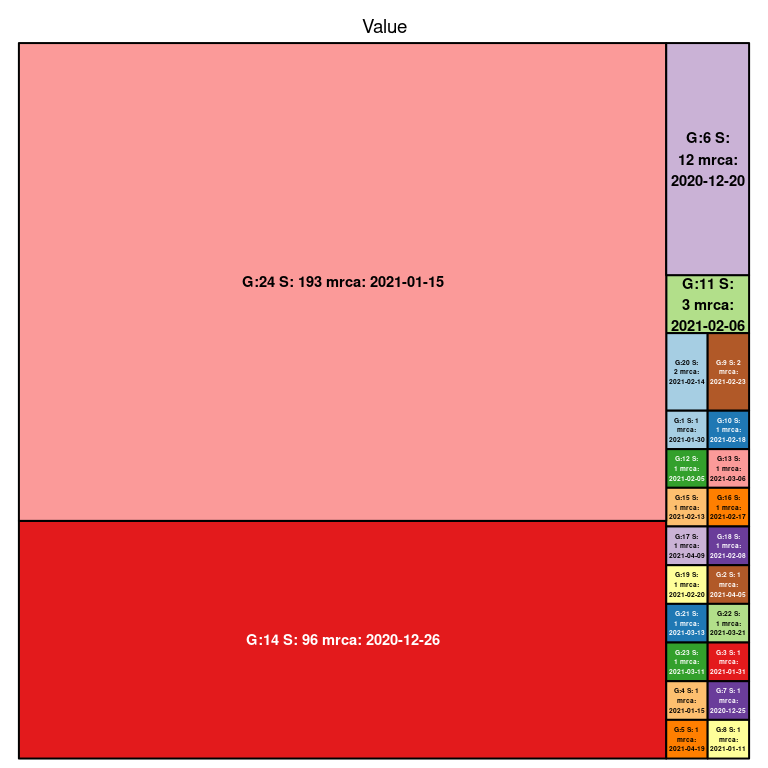

\# Resultater - B.1.351, “Sør Afrika variant”
================
Magnus Nygård Osnes
4/8/2021

Import og lokal smitte over tid

Antall sekvenser over tid som estimeres å være resultat av import samt
tilfeller som er resultat av smitte i Norge (Fig. 4).

Fig. 4. Import og transmisjon av B.1.351. Estimert antall
import-hendelser (øverst) og lokale transmisjoner (nederst) per uke. Det
er knyttet stor usikkerhet rundt estimater i perioden skravert i grått.

Fig. 5. Forhold mellom import og lokaltransmisjon av B.1.351 over tid i
Norge. OBS, ingen sekvenserte isolater som er nyere enn 10. mars.

Fig 6. Klyngestørrelser som funksjon av importtidspunkt, B.1.135 “TMRCA”
= time of most recent common ancestor, og indikerer estimert tidspunkt
for hver enkelt import. Den store klyngen som skiller seg ut her
tilsvarer Bodø-utbruddet.

<!-- -->

    ## Warning in fread("~/Dropbox/Covid/Southafrican_03_24/
    ## nextstrain_groups_niph_ncov_southafrican-2021-03-25_metadata.tsv"): Found and
    ## resolved improper quoting out-of-sample. First healed line 356: <<Croatia/
    ## HRV000_95/2021 32 20C Croatia Zagreb Zagreb EPI_ISL_1168769 Human A2a Zagreb
    ## "Dr. Andrija Stampar“ Teaching Institute of Public Health B.1.351 One month ago
    ## Europe Europe Female 20C Croatian Institute of Public Health 2021-02-09 Irena
    ## Tabain et al >>. If the fields are not quoted (e.g. field separator does not
    ## appear within any field), try quote="" to avoid this warning.

    ## Warning in if (is.na(give_tips) == F) {: the condition has length > 1 and only
    ## the first element will be used

    ## Norway/2276/2021 
    ##              165 
    ## [1] "imports are:1"
    ## [1] "Local transmissions are:0"
    ## Norway/3479/2021 
    ##              300 
    ## [1] "imports are:2"
    ## [1] "Local transmissions are:0"
    ## Norway/3252/2021 
    ##              329 
    ## [1] "imports are:3"
    ## [1] "Local transmissions are:0"
    ## Norway/2799/2021 
    ##              358 
    ## [1] "imports are:4"
    ## [1] "Local transmissions are:9"
    ## Norway/7234/2020 
    ##              483 
    ## [1] "imports are:5"
    ## [1] "Local transmissions are:9"
    ## Norway/0657/2021 
    ##              636 
    ## [1] "imports are:6"
    ## [1] "Local transmissions are:9"
    ## Norway/5164/2021 
    ##              708 
    ## [1] "imports are:7"
    ## [1] "Local transmissions are:9"
    ## Norway/4125/2021 
    ##             1079 
    ## [1] "imports are:8"
    ## [1] "Local transmissions are:9"
    ## Norway/3565/2021 
    ##             1162 
    ## [1] "imports are:9"
    ## [1] "Local transmissions are:11"
    ## Norway/6143/2021 
    ##             1227 
    ## [1] "imports are:10"
    ## [1] "Local transmissions are:11"
    ## Norway/3386/2021 
    ##             1245 
    ## [1] "imports are:11"
    ## [1] "Local transmissions are:11"
    ## Norway/6183/2021 
    ##             1471 
    ## [1] "imports are:12"
    ## [1] "Local transmissions are:35"
    ## Norway/3636/2021 
    ##             1497 
    ## [1] "imports are:13"
    ## [1] "Local transmissions are:35"
    ## Norway/3778/2021 
    ##             1525 
    ## [1] "imports are:14"
    ## [1] "Local transmissions are:35"
    ## Norway/4475/2021 
    ##             1546 
    ## [1] "imports are:15"
    ## [1] "Local transmissions are:35"
    ## Norway/4610/2021 
    ##             1562 
    ## [1] "imports are:16"
    ## [1] "Local transmissions are:35"
    ## Norway/3986/2021 
    ##             1571 
    ## [1] "imports are:17"
    ## [1] "Local transmissions are:135"
    ## Norway/4726/2021 
    ##             1578 
    ## [1] "imports are:18"
    ## [1] "Local transmissions are:135"
    ## Norway/6140/2021 
    ##             1595 
    ## [1] "imports are:19"
    ## [1] "Local transmissions are:135"

    ## Registered S3 method overwritten by 'treeio':
    ##   method     from
    ##   root.phylo ape

    ## ggtree v2.4.1  For help: https://yulab-smu.top/treedata-book/
    ## 
    ## If you use ggtree in published research, please cite the most appropriate paper(s):
    ## 
    ## - Guangchuang Yu. Using ggtree to visualize data on tree-like structures. Current Protocols in Bioinformatics, 2020, 69:e96. doi:10.1002/cpbi.96
    ## - Guangchuang Yu, Tommy Tsan-Yuk Lam, Huachen Zhu, Yi Guan. Two methods for mapping and visualizing associated data on phylogeny using ggtree. Molecular Biology and Evolution 2018, 35(12):3041-3043. doi:10.1093/molbev/msy194
    ## - Guangchuang Yu, David Smith, Huachen Zhu, Yi Guan, Tommy Tsan-Yuk Lam. ggtree: an R package for visualization and annotation of phylogenetic trees with their covariates and other associated data. Methods in Ecology and Evolution 2017, 8(1):28-36. doi:10.1111/2041-210X.12628

    ## 
    ## Attaching package: 'ggtree'

    ## The following object is masked from 'package:TreeTools':
    ## 
    ##     MRCA

    ## The following object is masked from 'package:ape':
    ## 
    ##     rotate

<!-- -->

# \_\_\_\_\_\_\_\_\_\_\_\_\_\_\_\_\_\_\_\_\_\_\_\_\_\_\_\_\_\_\_\_\_\_\_\_\_\_\_\_\_\_\_\_\_\_\_\_\_\_\_\_\_\_\_\_\_\_\_\_\_\_\_\_\_\_\_\_\_\_\_\_\_\_\_\_

# Read the metadata for this section

library(data.table) library(ggtree) library(treedater) mrsd =
max(metadat$`Collection Data`)

library(lubridate) most\_recent\_date = ymd(mrsd) most\_recent\_date =
decimal\_date(most\_recent\_date) start\_time =
most\_recent\_date-max(nodeHeights(tree)) time\_end =
most\_recent\_date-start\_time

# \_\_\_\_\_\_\_\_\_\_\_\_\_\_\_\_\_\_\_\_\_\_\_\_\_\_\_\_\_\_\_\_\_\_\_\_\_\_\_\_\_\_\_\_\_\_\_\_\_\_\_\_\_\_\_\_\_\_\_\_\_\_\_\_\_\_\_\_\_\_\_\_\_\_\_\_

# Import export estimates

source(“/Users/magnusnygardosnes/Dropbox/Rfunctions/Import\_export\_ace\_output.R”)
library(viridis) \#Result2 = matrix(unlist(lapply(mapped\_tree, FUN=
function(x) count\_import\_export(x, give\_tips
=norwegian\_tips)\[\[1\]\])), nrow=1000, ncol=2, byrow=T) Result=
count\_import\_export\_ace(tree, ace\_nodes =
castor$ancestral\_likelihoods, give\_tips = Norwegian\_tips,ace\_tips =
to.matrix(Locations,seq=c(“Norway”,“RoW”)),start\_time = start\_date)
quantile(Result2\[,1\], c(0.025, 0.50,0.975)); quantile(Result2\[,2\],
c(0.025, 0.50,0.975));
quantile(Result2\[,2\]/(Result2\[,2\]+Result2\[,1\]), c(0.025,
0.50,0.975))

\#\#MRCA’s lineages size. plot(hist(Result\[\[4\]\], breaks=100)) c2 =
data.frame(decimal2Date(cbind(Result$\`MRCA's\`)),Result$Lineage\_sizes)
colnames(c2)=c(“MRCA”,“Lineagesize”)

ggplot(c2, aes(MRCA, Lineagesize))+ geom\_hex()+
theme\_bw(base\_size=20)+ theme(legend.position=c(0.85,0.85))+
scale\_fill\_viridis()+ scale\_x\_date(date\_breaks=“1 week”)+
theme(axis.text.x=element\_text(angle=60, hjust=1))+ xlab(“Estimated
TMRCA”)+ylab(“Estimated linage size”)+
annotate(“rect”,xmin=as.Date(decimal2Date(time\_end-1/12)),xmax=as.Date(dat*d**a**t**e**s*\[*l**e**n**g**t**h*(*d**a**t*dates)\]),ymin=-Inf,ymax=Inf,alpha=0.2)

\#Lineage size versus \# library(hexbin) \#
my\_colors=colorRampPalette(rev(brewer.pal(11,‘Spectral’))) \#
pdf(paste0(path\_to\_results,“import\_and\_Export\_over\_time.pdf”),
width=10,height=10) \# plot(hexbin(c2),ylab=“Logarithm of lineage size”,
xlab=“Esitmated TMRCA”,colramp=my\_colors,xaxt=“n”) \# xaxisticks
=seq(from=range(Result$\`MRCA's\`)\[1\], to=range(Result$`MRCA's`)\[2\],
length.out=10) \# axis(1,at =xaxisticks,
labels=as.character(decimal2Date(xaxisticks))) \# dev.off() \#
plot(c2\[,1\],c2\[,2\],xlab=“Logarithm of lineage size”, ylab=“Esitmated
TMRCA”) \# \# \# weekly\_counts =
table(cut(Result$`MRCA's`,breaks=seq(start\_time,decimal\_date(mrsd),by=1/52)))
plot(weekly\_counts) \`\`\`
