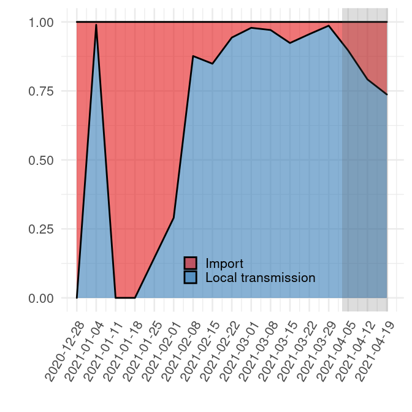
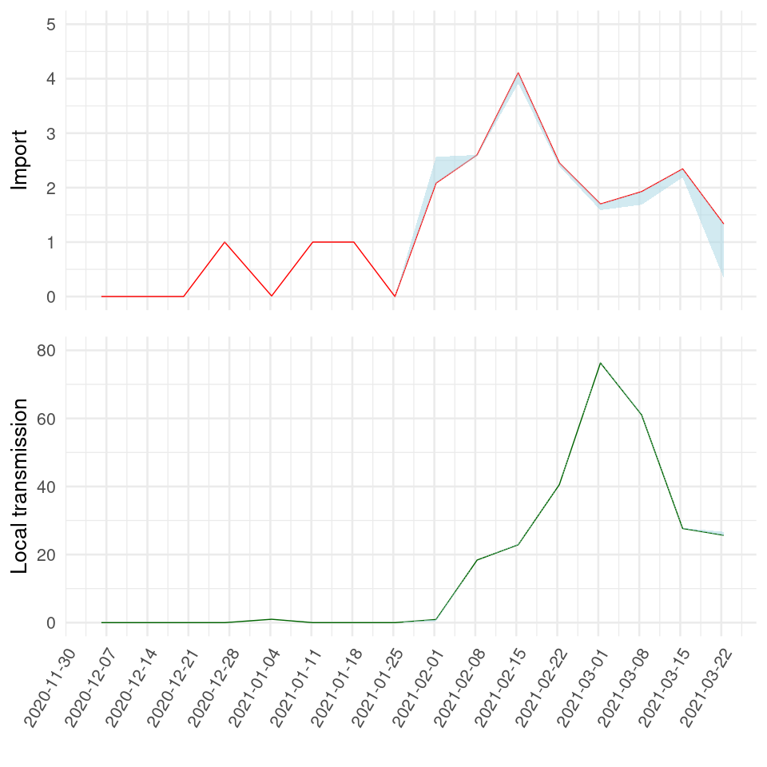

Results - B.1.351, “South Africa variant”
================
4/8/2021

Phylogeographic mapping

Ancestral character estimation was performed on a dated phylogeny
exported from NextStrain. Each isolate was assigned to one of two binary
categories: “Norway” or “Rest of the world (RoW)”. The output is
presented in Fig.1.

<!-- -->

##### Fig. 1. B.1.351 phylogeny colored by binary geographic mappings (Norway, rest of the world \[RoW\]).

The number of Norwegian isolates resulting from local transmission vs
introductions from abroad were estimated from the tree and is summarized
in Table 1.

##### Table 1. Estimated number of Norwegian infections that are caused by import and local transmission in geographically mapped phylogeny in Figure 1.

|                    |     2.5% |      50% |    97.5% |
|:-------------------|---------:|---------:|---------:|
| Import             |  19.0000 |  20.0000 |  22.0000 |
| Local transmission | 132.0000 | 134.0000 | 135.0000 |
| Import / Total     |   0.1234 |   0.1299 |   0.1429 |

<!-- -->

###### Fig. 2. Forhold mellom import og lokaltransmisjon av B.1.351 over tid i Norge. OBS, ingen sekvenserte isolater som er nyere enn 10. mars.

<!-- -->

###### Fig. 3. Import og transmisjon av B.1.351. Estimert antall import-hendelser (øverst) og lokale transmisjoner (nederst) per uke. Det er knyttet stor usikkerhet rundt estimater i perioden skravert i grått.

<!-- -->

###### Fig. 4. Klyngestørrelser som funksjon av importtidspunkt, B.1.135 “TMRCA” = time of most recent common ancestor, og indikerer estimert tidspunkt for hver enkelt import. Den store klyngen som skiller seg ut her tilsvarer Bodø-utbruddet.
