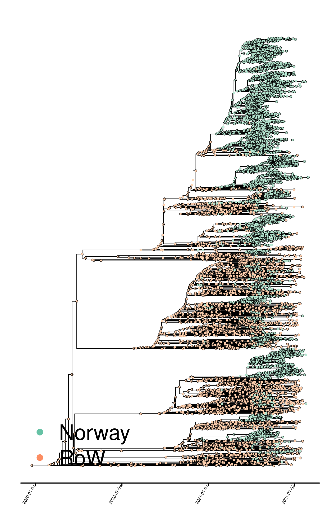

Resultater - B.1.1.7, “UK variant
================
4/8/2021

Import og lokal smitte over tid

Vi har sett nærmere antall sekvenser over tid som estimeres å være
resultat av import relativt til tilfeller som er resultat av smitte i
Norge (Fig. 1). Hvis man for eksempel har en import til Norge som
resulterer i videre smitte og ytterligere to tilfeller, vil disse telles
som ett tilfelle av import og to tilfeller av lokal transmisjon. Det er
viktig å huske på at disse estimatene er basert kun på sekvenserte
tilfeller. De absolutte tallene på importer og lokale transmisjoner vil
derfor være underestimerte, men kan anses som minimumsestimater.

De absolutte tallene presentert over vil generelt være underestimerte,
men antall importer per uke ser ut til å ha vært høyest i slutten av
januar. Den relative andelen av nye sekvenser som estimeres å være
resultat av import og lokal transmisjon blir ikke påvirket av dette, og
er derfor kanskje den mest informative måten å studere dette på.
Forholdet mellom import og lokal transmisjon er presentert i Fig. 2.

Importklynger

Videre kan vi se på størrelsen på utbrudd/klynger i Norge som en
funksjon estimert importtidspunkt. Dette er framstilt i Fig. 3 under.
Figuren illustrerer at de færreste importer resulterer i større
smitteklynger/utbrudd i Norge. De aller fleste større utbrudd og
smitteklynger med UK variant i Norge er resultat av importer fra slutten
av desember og fram til slutten av januar. Likevel ser vi at importer
også i februar har gitt opphav til smitteklynger i Norge.

##### Fig.1. fylogeni med binær geografisk mapping (Norge, resten av verden \[RoW\]).

The number of infections that are a results

|                    |     2.5% |    50% |    97.5% |
|:-------------------|---------:|-------:|---------:|
| Import             |  189.000 |  191.5 |  197.325 |
| Local transmission | 1130.675 | 1136.5 | 1139.000 |

<!-- -->

##### Fig. 2. Forhold mellom import og lokaltransmisjon av B.1.1.7 over tid i Norge. Lokal transmisjon har blitt relativt viktigere for epidemiologien av B.1.1.7 i Norge over tid.

<!-- -->

##### Fig. 3. Import og lokal transmisjon av B.1.1.7. Estimert antall import-hendelser (øverst) og lokale transmisjoner (nederst) per uke. Det er knyttet stor usikkerhet rundt estimater i

perioden skravert i grått"

<!-- -->

##### Fig. 4. Klyngestørrelser som funksjon av importtidspunkt, B.1.1.7. “TMRCA” = time of most recent common ancestor, og indikerer estimert tidspunkt for hver enkelt import.
