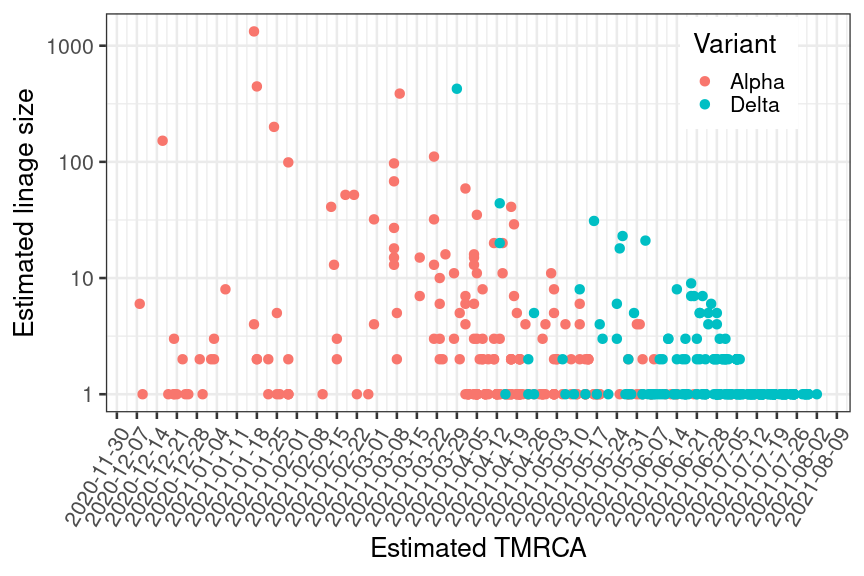
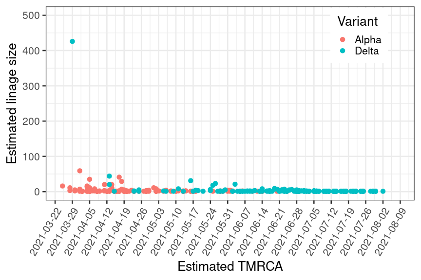

Comparative varianttransmissibility: Alpha vs Delta
================
31/05/2021

In these analyses we compare B.1.1.7 (alpha variant) with B.1.617.2
(delta variant) in terms of lineage sizes in Norway. Each inferred
import results in a single point in the plot below, and the lineage size
is plotted as a function of estimated TMRCA

<!-- -->

###### Figure 1: Transmission lineage sizes as a function of time of introduction. “TMRCA” = time of most recent common ancestor. Transmission lineages are colored by variant.

<!-- -->

###### Figure 2: Transmission lineage sizes as a function of time of introduction. “TMRCA” = time of most recent common ancestor. Transmission lineages are colored by variant. Same as above but linear scale and restricted to period of co-occurence.
