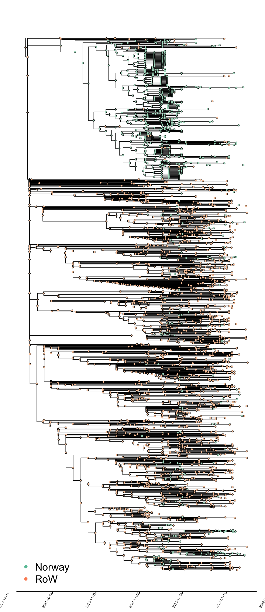
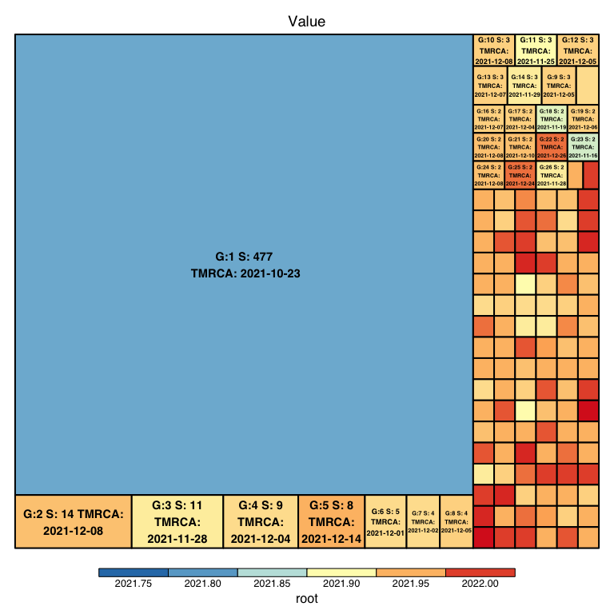
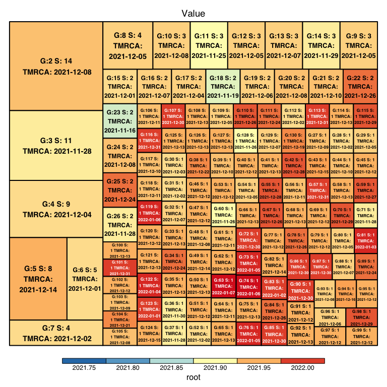
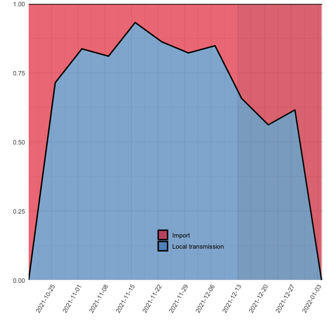
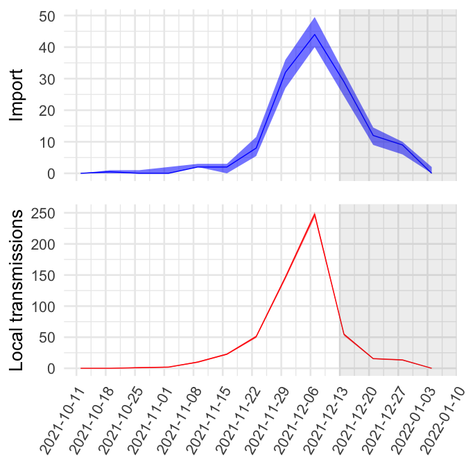
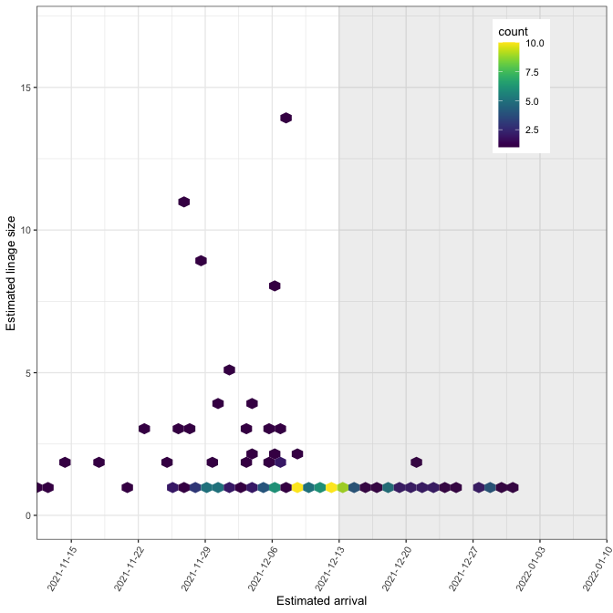
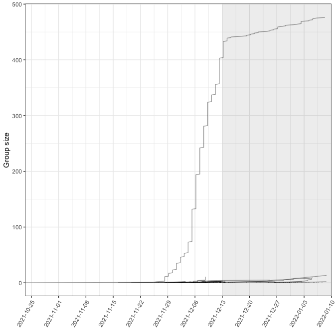
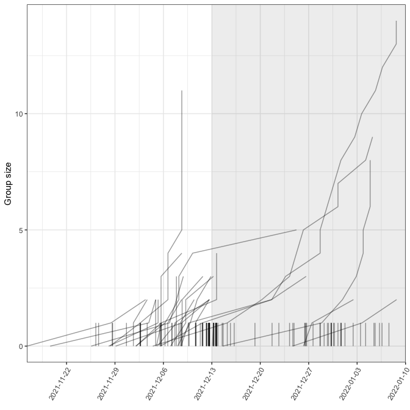

SARS-CoV-2 Omicron variant - 2022-01-22
================

## Disclaimer: These analyses must be interpreted with caution and estimates times of events may not be reliable

Phylogeographic analyses are only as good as the data we input. For
these analyses we have assumed that the temporal scaling of the
phylogenetic tree reliable and that the genetic diversity of the
sequences is representative of the Omicron epidemic in Norway. Most of
the early samples of Omicron in Norway came from a super-spreading event
at Aker Brygge. Thus, there is a substantial overrepresentation of the
Aker Brygge outbreak in the genetic data, which could influence the
results.

### Table of content

-   [Estimating the geographical location of omicron
    lineages](#geographical-mapping-of-the-lineages)
-   [Lineage size distributions](#lineage-size-distributions)
-   [Introductions and local
    transmission](#quantifying-introductions-and-local-transmission)
-   [Growth and size of individual lineages (NB. Keep in mind dection
    lag)](#growth-and-size-of-individual-lineages)

## Geographical mapping of omicron lineages

The analyses take a dated phylogeny exported from
[NextStrain](https://nextstrain.org/groups/niph/ncov/2022-01-17/omicron-BA-one)
as a starting point for quantifying imports and local transmission of
SARS-CoV-2 Omicron variant in Norway.The current set of sequences
includes 678 Norwegian genome sequences, and 1345 from the “Rest of the
world (RoW)” Each isolate is assigned to one of two binary categories:
“Norway” or RoW. The output is based on maximum likelihood ancestral
character estimation performed on the dated phylogeny and presented in
Fig.1.

##### Fig. 1. Omicron phylogeny colored by binary geographic mappings (Norway, rest of the world \[RoW\]).

The large group in Norway in top of the plot represents the large
outbreak at Aker Brygge and downstream transmission from this
super-spreading event (SSE). The other groups in Norway in different
parts of the tree represents separate introductions from the SSE.

## Lineage size distributions

Below is a visualization of the size of each transmission lineage
detected in Norway

<!-- -->

##### Fig. 2. Omicron transmission lineage sizes in Norway. G denotes the number assigned to each lineage, S denotes the size of the lineage and TMRCA denotes the age of the lineage. The area of the squares represents the size of the lineages.

The SSE outbreak dominates the Norwegian sequences. If we exclude this
lineage, the we obtain the following size distribution

<!-- -->

##### Fig. 3. Transmission lineage size as in Fig. 2, exluding the largest one.

The distribution of lineages is highly skewed with some . As can be seen
from the color of the groups and TMRCA, most of the large lineages
(orange and yellow) were introduced at earlier points in time, while the
recenty introduced lineages (red) are still small. Bear in mind that
these results are heavily influenced by the current set of available
sequneces and are will change as the lineages grow and we obtain updated
datasets.

## Quantifying introductions and local transmission

Based on the estimated locations of the lineages in Fig. 1 we can can
derive the number of importation events, and local transmission events
using the methods from
[LineageHomology](https://github.com/magnusnosnes/LineageHomology).
LineageHomology assumes that each lineage observed in Norway starts with
one importation event, and that each subsequent ancestral branching in
the lineage represents local transmission events.

##### Table 1. Estimated number of infections in Norway resulting from import and local transmission based on the phylogeographic analyses in Figure 1.

|                    |     2.5% |      50% |    97.5% |
|:-------------------|---------:|---------:|---------:|
| Import             | 134.4750 | 138.0000 | 144.5250 |
| Local transmission | 533.4750 | 540.0000 | 543.5250 |
| Import / Total     |   0.1983 |   0.2035 |   0.2132 |

Next, we estimate the fraction of introductions relative to local
transmission over time. In these and subsequent analyses it is important
to keep detection lag into account (see
<https://science.sciencemag.org/content/371/6530/708>). There will
always be a delay between the introduction and detection, which varies
from case to case. In the figures below, the last four weeks prior to
the time of sampling of the most recent included isolate is shaded to
indicate that estimates in this period is highly uncertain.

<!-- -->

##### Fig. 4. Relative quantification of infection source (new introduction / import vs local transmission). Grey shading indicates that inferences in this period (last 4 weeks) are uncertain due to detection lag.

The same output is visualized as absolute numbers in Fig. 5 below. It
should be noted that absolute estimates will be significantly shaped by
sampling density (i.e. if we only obtain 20% samples of the true cases
in a transmission lineage, the true size would in reality be five times
larger).

<!-- -->

##### Fig. 5. Absolute quantification of imports and local transmission events. Grey shading indicates that inferences in this period (last 4 weeks) are uncertain due to detection lag.

## Growth and size of individual lineages

Perhaps the most interesting aspect of quantifying introductions, is to
investigate the fate of the introduced viruses. Mandatory testing at the
border and/or mandatory quaranteens etc will obviously have a bearing on
the fate of new introductions from abroad. The plot below visualizes the
number of infections in Norway resulting from each identified virus
import event over time, stratified by inferred TMRCA of each introduced
lineage.

<!-- -->

##### Fig. 6. Transmission lineage sizes as a function of time of introduction. “TMRCA” = time of most recent common ancestor. Grey shading indicates that inferences in this period (last 4 weeks) are uncertain due to detection lag. NB. we have excluded the largest lineage that is visible in

<!-- -->

##### Fig. 7. Cumulative number of cases in each transmission lineage. The lines represents independent importation events, and the growth of the lines represents the cumulative number of cases observed in each linage over time.

The rapid growth of the SSE dominates the picture. After the initial
event of spread the growth of this lineage continued, but in a slower
fashion. This could also be a result of targeted sampling and sequencing
of cases connected to this outbreak, followed by a less intense sampling
regime of this afterwards. Or it could be actual, in that it first
spread rapidly, and then slower in the community.

If we exclude the known SSE, we obtain the following figure.
<!-- -->

##### Fig. 8. Cumulative number of cases in each transmission lineage
